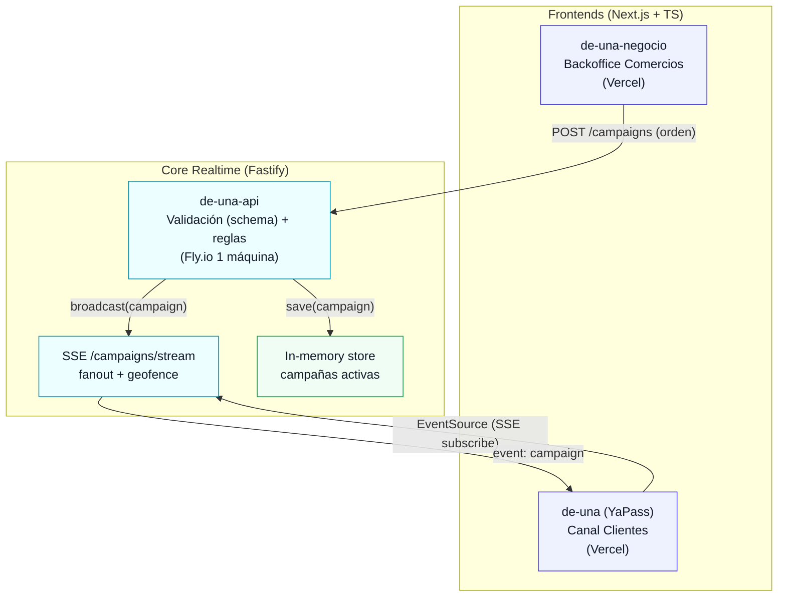
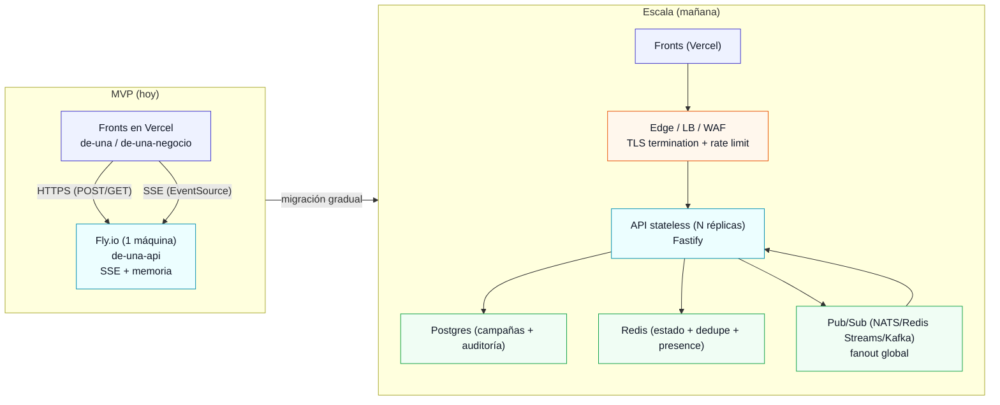
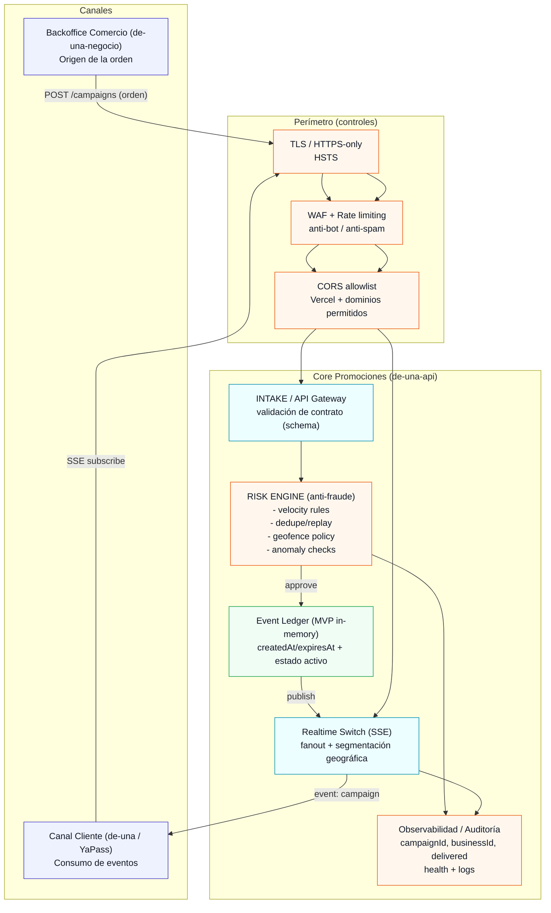

# Arquitectura, escalabilidad y seguridad (pitch)

Estos diagramas están escritos para **explicar el MVP como si fuera un “core bancario ligero”**: cada promoción entra como una **orden**, pasa por **controles de riesgo**, queda **trazada**, y se distribuye por un **switch realtime** con políticas (geofence).

## Diagrama de arquitectura (alto nivel)

## Diagrama de escalabilidad (hoy → mañana, sin reescribir)

## Diagrama de seguridad + antifraude (enterprise “humo” pero coherente)

## Talking points “vendibles” (anti‑fraude)

- **Órdenes transaccionales**: una promo no es “un post”; es una **orden** que entra al core con contrato y validación.
- **Risk Engine**: antes de emitir, se aplican **controles de riesgo** (velocity, dedupe/replay, anomalías, geofence).
- **Switch realtime**: la entrega no es “broadcast”; es un **switch** que enruta por políticas (segmentación geográfica).
- **Trazabilidad**: cada emisión tiene `campaignId` y métricas de entrega (`delivered`, `subscribers`) para auditoría operativa.
- **Evolución enterprise**: in-memory → Postgres + Redis + Pub/Sub sin rehacer los canales.

